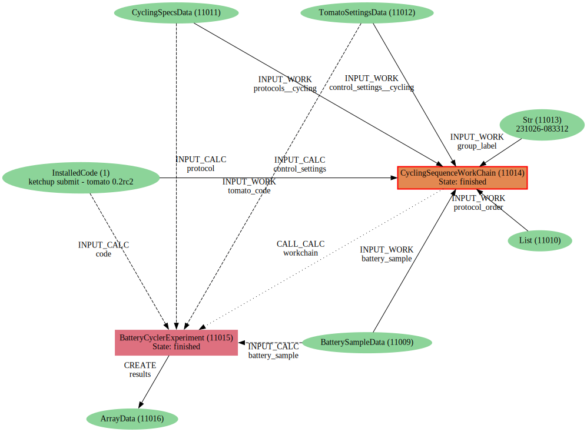

# Results Importer

This utility can be used to import into AiiDA results obtained by means other than the AiiDA-Aurora workflow.

For example, when results are obtained from EC-lab, `.mpr` files can be converted into `.json` files resembling those produced by `tomato`. This utility will import such files as AiiDA `ArrayData` and recreate the (limited) provenance graph (below) in a near-identical way to that which would have been produced if the calculation was executed via AiiDA.

The logic is contained in `results_importer.py`. A notebook is provided as a convenient template to get started.

### `verdi node graph generate --identifier pk -f svg -e circo <WorkChain-pk>`

